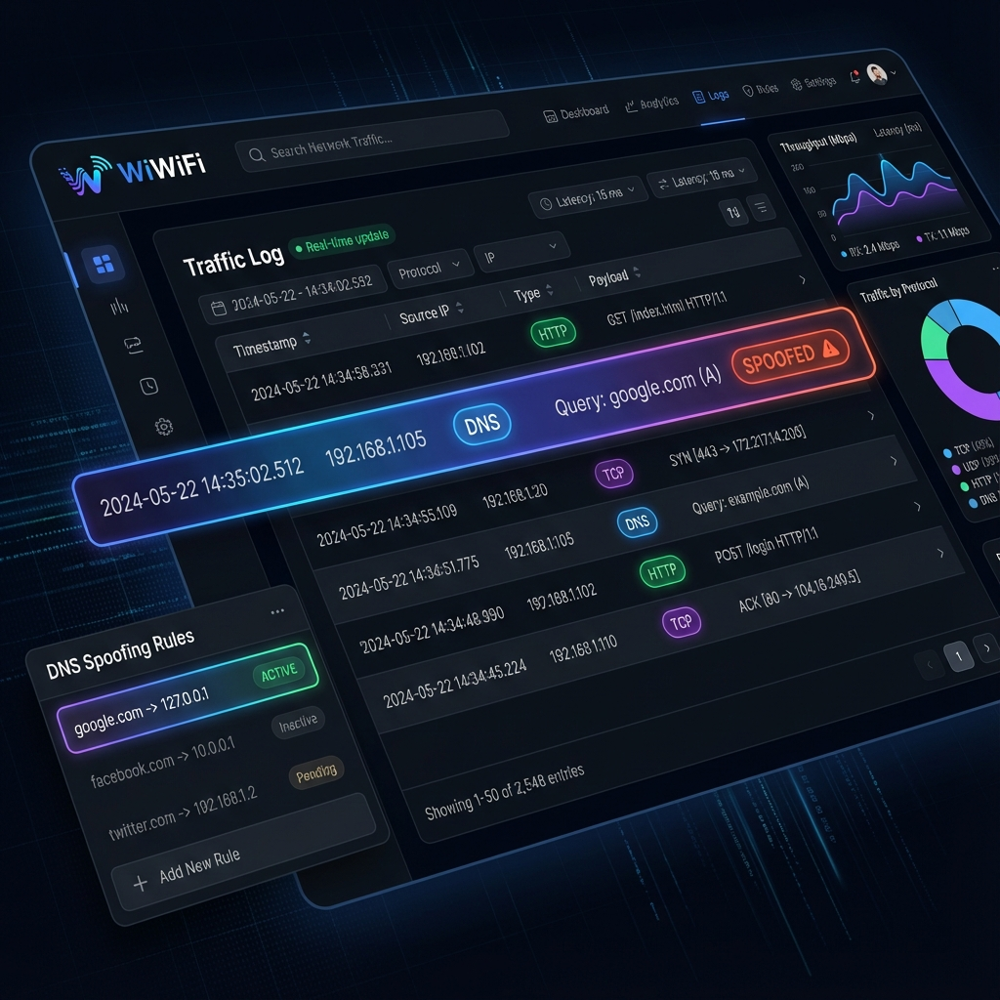
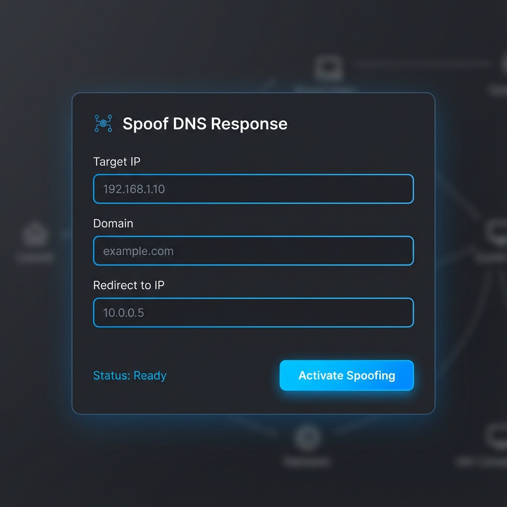

# WiWiFi - Network Traffic Sniffer & Analysis Tool

WiWiFi is a powerful Python-based application designed to open an unprotected WiFi hotspot and capture/analyze network traffic passing through it. It features a modern Web UI for real-time monitoring and an "AI" component that scans for sensitive information such as PII, URLs, and names.

> [!WARNING]
> This tool is for **educational and analysis purposes only**. Use it only on hardware and networks you own or have explicit permission to test. Unauthorized interception of network traffic may be illegal.

## Features

- **Open Hotspot Creation**: Automated setup of `hostapd` and `dnsmasq` to create an unprotected WiFi access point.
- **Real-time Sniffing**: Captures IP traffic using Scapy.
- **AI Analysis Layer**: 
    - Automatically detects URLs, Email addresses, Phone numbers, and Social Security Numbers (PII).
    - Identifies potential names through pattern recognition.
- **Premium Web UI**:
    - Real-time traffic log.
    - Searchable payloads for specific phrases.
    - Filtering by Client MAC address and IP address.
    - "AI Insights" panel for floating up critical data points.
- **Simulation Mode**: Test the entire analysis and UI pipeline without requiring real WiFi hardware or root privileges.

## UI Screenshots


*A look at the real-time Traffic Log with DNS, HTTP, and TCP packet types identified.*


*Configuring a targeted DNS redirection rule.*

## Project Structure

- `backend/`: FastAPI server, Sniffer logic, and Database management.
- `frontend/`: Vanilla JS/CSS Single Page Application.
- `scripts/`: Implementation scripts (setup/cleanup placeholders).
- `requirements.txt`: Python dependencies.

## Internal Logic

### Analysis Engine
The Analysis Engine (`backend/analyzer.py`) uses regular expressions to scan packet payloads for sensitive data. It classifies findings into several categories:
- **PII Detection**: Identifies Emails, Phone numbers, and Social Security Numbers (SSN).
- **Financial Data**: Scans for 13-16 digit sequences that match Credit Card number patterns.
- **Infrastructure**: Extracts URLs and identifies potential person names using heuristic capitalized word sequences.

### Sniffer Logic
The core sniffer (`backend/sniffer.py`) is built on Scapy and operates in two modes:
- **Real Mode**: Uses `scapy.all.sniff` to capture live IP traffic on a specified interface. Requires root privileges.
- **Simulation Mode**: Generates synthetic packets (Ethernet/IP/UDP/TCP/DNS) to test the analysis pipeline and UI without special permissions or hardware.

The sniffer processes each packet through a pipeline:
1. **Header Extraction**: Retrieves source/destination IP and MAC addresses.
2. **DNS Detection**: Identifies queries by checking the `DNS` layer and the **QR bit** (`qr == 0`).
3. **Spoofing Check**: Matches queries against active rules.
4. **Analysis & Storage**: Hands off payloads to the Analysis Engine and saves results to the SQLite database.

### DNS Spoofing
WiWiFi implements targeted DNS redirection:
- **Interception**: When a DNS query matches a configured `(Target IP, Domain)` rule, the sniffer intercepts it.
- **Response Crafting**: It constructs a fake `DNSRR` (DNS Resource Record) response with the desired `spoof_ip`.
- **Injection**: The crafted packet is injected back into the network with swapped headers (src/dst), causing the client to redirect to the attacker-controlled IP.
- **Visual Feedback**: Spoofed packets are marked with a bold **"SPOOFED!"** badge in the UI traffic log.

## Installation

### Prerequisites
- Linux OS (tested on gLinux/Rodete).
- Root privileges (for real hotspot/sniffing).
- WiFi hardware supporting AP Mode (if using for real hotspots).

### Setup
1. Clone the repository:
   ```bash
   git clone https://github.com/elibaba/WiWiFi.git
   cd WiWiFi
   ```

2. Install dependencies:
   ```bash
   pip install -r requirements.txt
   ```

## Usage

### Run in Simulation Mode (Default)
This mode generates synthetic traffic for testing the UI and analysis logic:
```bash
export PYTHONPATH=$PYTHONPATH:.
python3 backend/main.py
```
Then navigate to `http://localhost:8000`.

### Run for Real Analysis
1. Ensure your WiFi interface (e.g., `wlan0`) is not managed by other network managers.
2. Run as root:
   ```bash
   sudo python3 -m uvicorn backend.main:app --host 0.0.0.0 --port 8000
   ```
3. Use the UI to start the hotspot and sniffer on your specific interface.

## Container Deployment

WiWiFi can be easily deployed using Docker and Docker Compose.

### Using Docker Compose (Recommended)

1.  **Build and Run (Simulation Mode)**:
    ```bash
    docker-compose up --build
    ```
    Access the UI at `http://localhost:8000`.

2.  **Run for Real Hardware Interception**:
    To capture real traffic, the container needs host network access and high privileges. Edit `docker-compose.yml` to uncomment the `network_mode: "host"` and `privileged: true` lines, then run:
    ```bash
    sudo docker-compose up
    ```

### Using Docker Directly

1.  **Build the image**:
    ```bash
    docker build -t wiwifi .
    ```

2.  **Run in Simulation Mode**:
    ```bash
    docker run -p 8000:8000 wiwifi
    ```

## Disclaimer
The contributors to WiWiFi are not responsible for any misuse or damage caused by this tool. Use responsibly.
